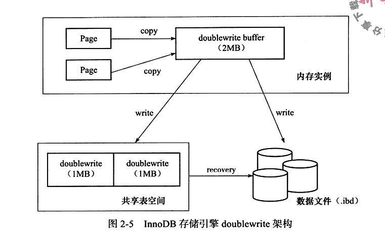
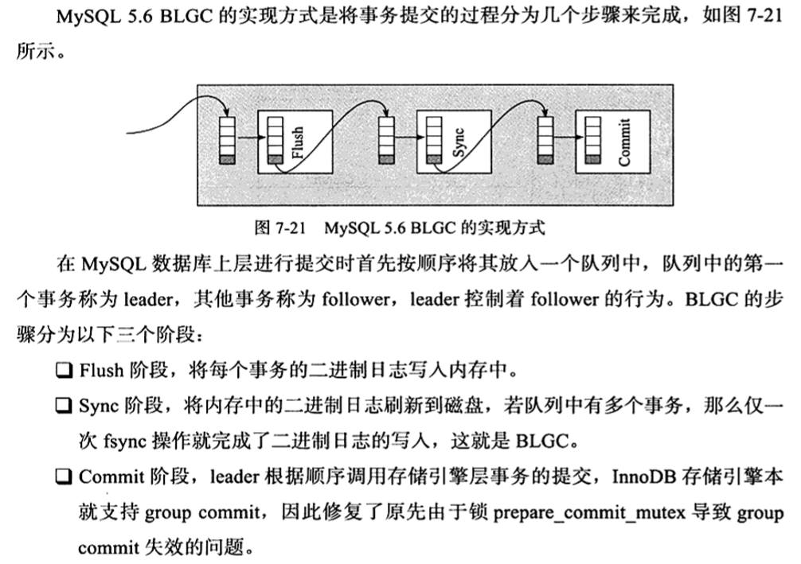
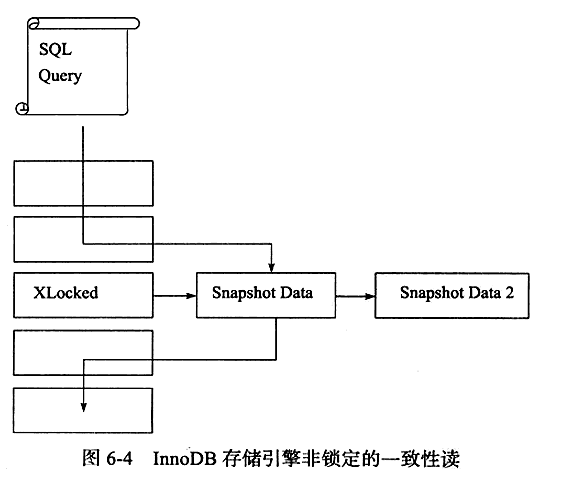
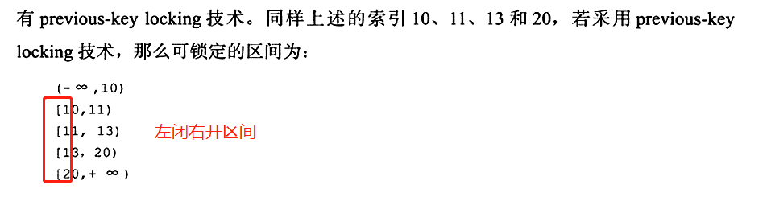
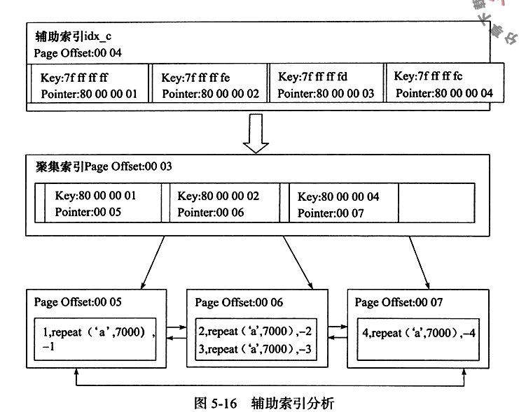
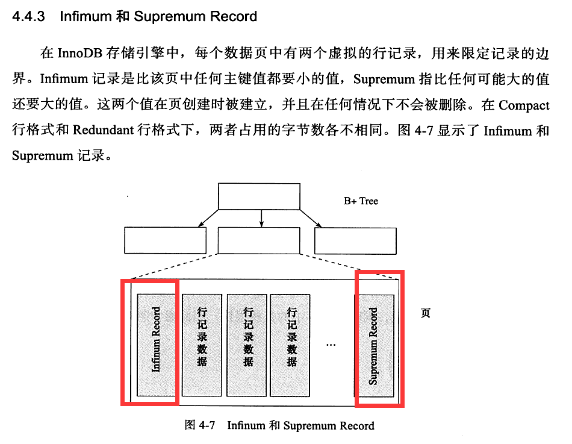
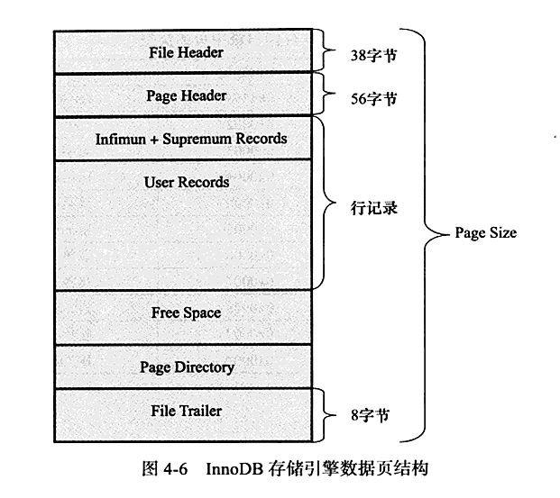
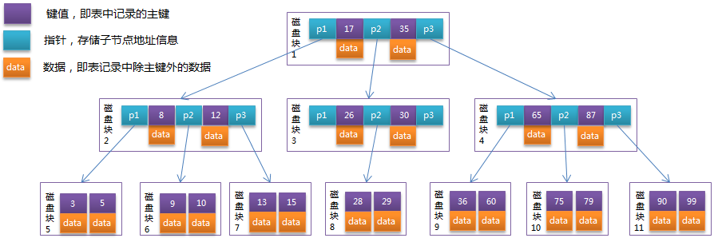
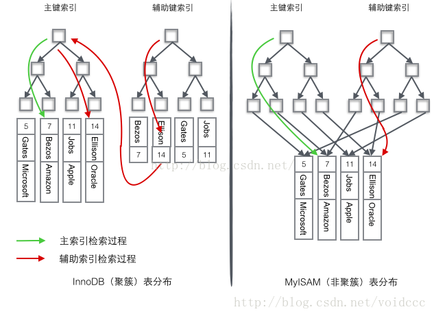

# 数据库总论

[toc]

## 一，基础概念

### 数据依赖
>1，函数依赖(Function dependency，FD)：一种最基本的数据依赖，一个或一组属性可以决定其他的属性；
>2，多值依赖(Multi-valued Dependency，MVD)：一个或一组属性可以决定其他属性的多个不同值，在数据库设计的时候基本不用考虑；
>3，连接依赖(Join Dependency，JD)：将一张表投影拆分，若将拆分后的表连接后能够完全得到原表，则称拆分表连接依赖，在数据库设计的时候基本不用考虑

### 范式
>1，1NF:如果一个关系模式 R 的每一个属性的域都只包含单一的值(每个属性类型都得是原子)，则称 R 满足第一范式
>2，2NF：如果关系模式 R 满足第一范式，而且它的所有非主属性完全函数依赖于候选 键，则 R 满足第二范式。 （在1NF的基础上不存在部分函数依赖）。如例，主键是（S#，C#），然而表中的姓名，年龄，地址等信息可以由S（学号）确定，也就是存在了部分函数依赖，所以不满足二范式
>3，3NF：如果关系模式 R 满足 2NF，并且它的任何一个非主属性都不传递依赖于任何 候选键，则 R 满足 3NF。如果一个关系模式 R 不存在部分函数依赖和传递函数依赖，则 R 满足 3NF。（在2NF的基础上不存在属性对主键的传递依赖）
>4，4NF：在3NF的基础上消除数据之间可能存在的多值依赖
>5，5NF：在4NF的基础上消除数据之间可能存在的连接依赖


```2NF例子更清晰，部分依赖，完全依赖
2NF的违例只会出现在候选键由超过一个字段构成的表中，因为对单关键字字段不存在部分依赖问题。
例子：(学号, 姓名, 年龄, 课程名称, 成绩, 学分)
候选键只有一个，就是(学号，课程名称)，则主键就是(学号，课程名称)
存在如下决定关系：
1：(学号, 课程名称) → (姓名, 年龄, 成绩, 学分)
2：(课程名称) → (学分)
3：(学号) → (姓名, 年龄)
其中，姓名、年龄、学分是部分依赖于主键的，而成绩是完全依赖于主键的，存在部分依赖关系，所以不满足第二范式。
```


### 反范式与日常业务数据库定义


## 二，重点技术原理

### mysql体系结构


>1，多版本并发控制MVCC获得高并发，并实现了4种隔离，默认Repeatable read
>2，insert buffer：B+tree
>3，二次写 double write：数据页的可靠性，为了解决部分写失效（正在写宕机了），redo log可用数据恢复，但是如果物理页发生损坏，就redo log也没用了。需要一个页的副本，来进行redo log恢复。double write buff=2MB。对缓冲池脏页刷新，不直接写入磁盘，而是先memcpy函数复制到内存的doublewrite buff，之后每次1MB顺序写入共享表空间的物理磁盘上（128页=2MB）。
>4，自适应哈希索引（热点数据），AHI=adaptive hash index。B+tree通常有3~4层，需要3~4次查询。InnoDB自动为热点页构建哈希索引
>5，预读，read ahead
>6，异步IO
>7，刷新邻接页：当刷新一个脏页时，如果该页所在区的所有页有脏页，那么一起刷新



### 引擎
>1，InnoDB
>2，MyISAM
>3，Memory：数据存放在内存
>4，NDB：集群引擎
>5，Archive：只支持select和insert
>6，Federated
>7，Maria

#### 各种引擎比较


#### InnoDB
>1，聚集方式，表的存储按照逐渐的顺序进行存放，没有主键，则默认生成一个6B的ROWID
>2，MVCC，多版本并发控制，获得高并发


#### MyISAM
>1，不支持事务，表锁设计，支持全文索引，主要面向OLAP
>2，只缓存索引文件，不缓冲数据文件

### checkpoint机制：缓冲池-》磁盘
>1，**为了避免数据丢失，当前事务数据库都采用Write Ahead log策略，即当事务提交时，先写重做日志，再修改页**
>2，缩短数据库恢复时间
>3，缓冲池不够用时，将脏页刷新到磁盘
>4，重做日志不可用时，刷新脏页
>5，当数据库发生宕机，数据库不需要重做所有的日志，只需对checkpoint后的重做日志进行恢复

>PS：脏页：缓冲池中的页和磁盘上页的数据不一致

#### sharp checkpoint：默认的工作方式
>1，数据库关闭时将所有的脏页刷新回磁盘
>2，show variables like '%_shutdown' 可以看到innodb_fast_shutdown=1
>3，innodb_fast_shutdown=0：数据库关闭时，innodb需要完成所有的full purge和merge insert buffer，并且所有脏页刷新回磁盘，Inoodb升级，必须是设置为0；=1：不需要完成full purge和merge insert buffer，需要所有脏页刷新回磁盘。=2：不需要完成full purge和merge insert buffer，不需要所有脏页刷新回磁盘，重启数据库时恢复数据

#### fuzzy checkpoint：只刷新一部分脏页
>1，master thread checkpoint：每秒或每十秒刷新一定比例的脏页回磁盘
>2，Flush_LRU_LIST checkpoint：保证LRU列表有约100个空闲页可使用,查询线程中检查可用，可能会阻塞用户查询操作
>3，async/sync Flush checkpoint：重做日志不可用的情况下，强制将一部分脏页刷新到磁盘
>4，dirty page too much checkpoint

### InnoDB内存数据对象
>1，LRU(Latest recent used，最近最少使用，最频繁的再LRU列表前端))
>2，midpoint insertion strategy：新访问的页，不直接放到LRU列表的前端，都是放到midpoint（默认是5/8，show variables like ‘innodb_old_blocks_pct’;显示百分比） ,midpoit之前称为new列表，之后为old列表。可能新访问的不是热点数据，直接插入LRU列表前端，可能会把列表尾的热点数据刷出缓冲池


#### 查询


### 事务
1，页锁，这样数据量很大的场景，锁的开销就会很小

#### 隔离级别
>1，未提交读（READ UNCOMMITTED）：事务中的修改，即使没有提交，对其它事务也是可见的。最低级别，任何情况都无法保证
>2，提交读（READ COMMITTED）：一个事务只能读取已经提交的事务所做的修改。换句话说，一个事务所做的修改在提交之前对其它事务是不可见的。可避免脏读的发生。**在服务器上先删除后插入，但是删除事务还没commit，所以在二进制日志中记录的是先插入后删除，在主从通过二进制日志同步数据的话，可能导致数据不一致**，**没有gap lock，可以范围插入**
>3，可重复读（REPEATABLE READ）：保证在同一个事务中多次读取同样数据的结果是一样的。可避免脏读、不可重复读的发生
>4，可串行化（SERIALIXABLE）：强制事务串行执行。可避免脏读、不可重复读、幻读的发生。**InnoDB存储引擎会对每个select语句后自动加上lock in share mode，即为每个读取操作加上共享锁**

 隔离级别|脏读|不可重复读|幻影读
---------|----------|---------|---------
 RU|YES|YES|YES
 RC|NO|YES|YES
 RR|NO|NO|YES
 SERIALIXABLE|NO|NO|NO

>1，脏读：一个事务读取到另外一个事务未提交的数据
>2，不可重复读：一个事务读取到另外一个事务已经提交的数据，也就是说一个事务可以看到其他事务所做的修改
>3，虚读(幻读)：是指在一个事务内读取到了别的事务插入的数据，导致前后读取不一致。和不可重复读类似，但是有什么区别呢？现象一样，但是是不同的方面，不可重复读，是指一个事务中的多次操作，会读取到其他事务的提交的结果，是隔离级别导致的，而幻读，是因为锁的粒度导致的
>4，**在RR的隔离级别下，用next-key lock解决幻读问题**

#### phantom problem 幻影读问题：next-key lock=record lock+gap lock解决幻影读问题
>1，在同一事务下，连续执行两次同样的sql，可能导致不同的结果，第二次可能返回之前不存在的行，如下：RR隔离级别下，通过Next-key lock解决了这个幻影读问题
```
T1
1：select * from tab where id>2 for update;//这个会加排他锁，返回3，5
//在RC模式下，没有gap lock，在这之间执行了T2（insert id=4），插入了一条数据id=4，因为没操作3，5，不涉及3，5记录的行锁，是可以插入的，在RR会有gap lock，就不可以插入
2：select * from tab where id>2 for update;//返回3，4，5
```
>例证：T1执行select，会有排他锁，T2执行insert会等待
```
事务1
-- select @@session.tx_isolation;
START TRANSACTION;
select * from test where ord>2 for update;

-- commit;
```
```
事务2：
START TRANSACTION;
INSERT into test(ord,keyword) VALUES(4,"hello");
-- commit;
```
```
事务3：重复读，就算事务2提交了，也看不到记录4
-- select @@session.tx_isolation;
START TRANSACTION;
select * from test where ord>2;

-- commit;
```
>2，在默认Repeatable read隔离级别下，Next-Key Locking机制避免幻象读问题

#### 幻读问题思考

```
举例：1.a事务先select，b事务insert确实会加一个gap锁，但是如果b事务commit，这个gap锁就会释放（释放后a事务可以随意dml操作），
2.a事务再select出来的结果在MVCC下还和第一次select一样，
3.接着a事务不加条件地update，这个update会作用在所有行上（包括b事务新加的），
4.a事务再次select就会出现b事务中的新行，并且这个新行已经被update修改了
事务A：
-- START TRANSACTION;
-- select * from test where ord>4; //第一次select
-- select * from test where ord>4;//第二次select
-- update test set keyword='del';//第一次更新

-- select * from test where ord>4;//第三次select
-- COMMIT

事务B：
-- START TRANSACTION;
-- insert test(ord,keyword,word) VALUES(8,'inset8','update8') //第一次插入
-- 
-- commit

现象描述：
1，事务A，执行第一次查询得到ord=5，10
2，事务B，执行插入ord=8
3，事务A，执行第二次查询依然得到ord=5，10，因为RR等级下，一致性非锁定读，读的是undo log上的快照
4，事务A，执行第一次无条件更新
5，事务A，执行第三次查询，ord=5，8，10，在一个事务中出现了事务B的插入的数据ord=8

原因：UPDATE语句执行之后，会将当前记录上存储的事务信息更新为当前的事务，而当前事务所做的任何更新，对本事务所有SELECT查询都变的可见，因此最后输出的结果是UPDATE执行后更新的所有记录。属于ANSI SQL标准，不算是bug


举例二：next-key lock会范围锁
-- START TRANSACTION;
-- select * from test where ord=8 for UPDATE;
COMMIT 这样会导致ord=8（行锁），（5，8）和（8，10）区间被锁（gap 锁）（=next-key lock），但是（11，无穷大）不会，因为next-key lock把数据分区间了
```
* [美团技术团队分享的事务隔离-不错](https://tech.meituan.com/2014/08/20/innodb-lock.html)

* [淘宝技术团队对innodb源码的分析](http://mysql.taobao.org/monthly/2017/06/07/)

#### 两段锁协议
>1，通常大并发，为了预防死锁，推荐使用一次封锁法，即方法开始时将预先知道的数据，一次性全部锁住
>2，数据库事务没法预先知道要用到哪些数据，使用采用了两段锁（加锁，解锁）
>3，加锁阶段：读：加共享锁，写：申请排他锁，可能需等待到加锁成功；（随时）
>4，解锁阶段：该阶段只能解锁，不能再加锁。（commit or rollback）

#### 快照读和当前读
>1，快照读：普通select
>2，当前读：select for update，select lock in share mode，insert，delete，update，都是操作的当前数据，需要加锁

#### innodb在每行隐含添加两个字段来实现MVCC
>1，这两个值是，行数据创建时间，行数据过期时间，在实际操作中，存储的不是时间，而是版本号，每开启一个事务，版本号递增
>2，MVCC在RC,RR下有效，RU，总是读取最新数据，serializable对每行都加锁


#### 同一事务中，对同一块数据即读又写，会彼此冲突，即基于共享锁（读写锁）互斥
```
select @@session.tx_isolation;
START TRANSACTION;
select * from users where uid='1007235';
-- select * from users where nick_name='test2' for update;
update users set gender=2 where uid='1007235';//等待读锁释放
-- select * from users where uid='1007235';
-- COMMIT;
```
### 串行隔离级别是可重复读的
``` 
事务A：
 set SESSION TRANSACTION ISOLATION LEVEL SERIALIZABLE;

START TRANSACTION;
select * from users where uid='1007235';
-- select * from users where nick_name='test2' for update;
update users set gender=2 where uid='1007235';
-- COMMIT;
``` 
``` 
事务B：
set SESSION TRANSACTION ISOLATION LEVEL SERIALIZABLE;
START TRANSACTION;
select * from users where uid='1007235' 
-- for update;

-- COMMIT;
```


#### select for update 会触发行锁，X锁
>1，事务A和B串行
>2，事务中两个select不会导致死锁
``` 
事务A：
START TRANSACTION;
select * from users where uid='1007235' for update;
select * from users where nick_name='test2' for update;
update users set gender=1 where uid='1007235';
COMMIT;
```
``` 
事务B：
START TRANSACTION;
select * from users where uid='1007235' for update;
select * from users where nick_name='test2' for update;
update users set gender=2 where uid='1007235';
COMMIT;
```
#### 事务分类
>1，扁平事务flat transaction：最频繁的类型事务，所有操作处于同一层次
>2，带有保存点的扁平事务flat transaction with save points
>3，链事务chained transaction：提交事务和开始下一个事务合并为一个原子操作
>4，嵌套事务nested transaction
>5，分布式事务 distribution transaction：innoDB的事务必须是串行化事务，两段式提交（1，prepare准备阶段，2，rollback或commit），XA事务支持分布式事务的实现（语法：XA {BEGIN|START} xid {join|resume}}）


#### 事务使用，不好的习惯
>1，循环中提交事务，性能差
>2，使用自动提交：1)mysql C API是默认自动提交，2）Mysql python API是set AUTOCOMMIT=0,禁用自动提交，不同语言的API是不一样的  3）开发人员应该掌握事务的控制权限（何时开始结束）
>使用自动回滚：以致开发人员不知道事务执行中抛出的具体的异常

#### 事务的实现
>1，redo log即为重做日志，用来保证事务的原子性和持久性，undo log用来保证事务的一致性
>2，redo恢复提交事务修改的页操作，undo回滚记录到某个特定版本
>3，redo物理日志，记录的页的物理修改操作，undo是逻辑日志，记录每行的操作
>4，redo两部分：1，内存中的重做日志缓冲，易失，2，重做日志文件，持久
>5，redo log以512B的块大小进行存储。（扇区大小=512B）。实际存储=512B-12B（redo log header）-8B（redo log tailer）=492B。
>6，事务T1和事务T2可以合并成一个块
>7，undo log 上有MVCC机制，可以实现快照读，一致性非锁定读

>PS：：我们知道事务的实现基于redo log（原子性和持久性）和undo log（一致性）和锁的机制（隔离性），但是具体是怎么能做到准确的呢，实现的具体逻辑是什么？
>那就需要分析它们的数据结构，和基本的程序逻辑


>1，每个insert，记录一个delete到undo log，每个delete，记录一个insert到undo log，每个update，记录一个相反的update到undo log
>2，回滚
>3，支持MVCC机制
>4，undo log会产生redo log，实现undo log的持久性
>5，事务提交时不能立马删除undo log，而是放入undo log链表中，等待purge线程最后删除，通过history-list,深度优先算法，逐步清除没有其他事务引用的undo log
>6，一个页上可以存放多个事务的undo log

##### group commit
>1，通常事务提交都有两个步骤，1，内存事务信息写入redo log缓存，2，fsync，redo log写入磁盘
>2，有个参数可以控制redo log写磁盘的时机

#### 开启二进制日志的事务提交过程
>1，二进制日志是数据库上层写入的，和引擎无关
>2，redo log是innodb的为了实现数据原子性和持久性的设计
>3，开启二进制日志的事务提交步骤：1）innodb进行prepare操作。2）mysql上层写入二进制日志。3）innnodb写入redo log（1，修改内存事务信息，写入重做日志缓存，2，fsync缓存更新到磁盘）。
>4，步骤2一旦操作完成，就确保了事务的提交，即使在步骤3数据库宕机。
>5，此外，需要注意的是，每个步骤都需要进行一次fsync，才能保证上下两层数据的一致性


###### BLGC:binary log group commit
>1，为什么需要保证binary log的写入顺序和innodb的redo log事务提交顺序一致？因为备份和恢复的需要
>2如何保证两者顺序一致？BLGC



##### LSN:Log sequence number
>1，redo log写入的总量
>2，checkpoint的位置：数据恢复的时候，根据这个日志序列号恢复
>3，页的版本

### 锁

#### 锁的类型
>1，共享锁：允许读一行数据
>2，排他锁：允许删除或更新一行数据

#### 锁的精度
>1，行锁
>2，表锁
>3，意向锁:意向共享锁（IS：一张表中某几行的共享锁）和意向排他锁（IX：一张表中某几行的排他锁）

#### 事务锁结构

>1,select * from information_schema.INNODB_TRX;


>2,select * from information_schema.INNODB_LOCKS;


#### 一致性非锁定读
>1，MVCC
>2，当读取的行正在delete或update操作，select不会等待，而是读取快照数据
>3，RC隔离级别，总是读取最新的一个快照数据，RR则总是读取事务开始时的快照，因为del或者update，对RR是不可见的


#### 一致性锁定读
>1，InnoDB默认是可重复读的（ REPEATABLE READ）， MVCC多版本并发控制，实现一致性地非锁定读操作。
>2，InnoDB存储引擎的select操作使用一致性非锁定读；也就是说， select操作不会去请求共享锁S；
如何显示地使用一致性锁定读呢？
>3，第一种方法，显式地加共享锁S： select * from t1 where id=1 lock on share mode;
>4，第二种方法，显式地加排他锁X： select * from t1 where id=1 for update;

#### 自增长与锁
>1，每个含有自增字段的表都有自增长计数器
>2，**auto-inc locking：特殊的表锁机制，但是不是在事务完成后释放，而是完成自增长sql后立即释放**
>3，表锁机制性能太差，之后有提供了轻量级互斥量的自增长机制。innodb_autoinc_lock_mode默认为1
>4，插入类型：insert-like，simple inserts，bulk inserts，mix-mode inserts

#### 外健和锁
>1，插入数据时，会先查询外健关联的表，会使用select ... lock in  share mode加共享S锁，如果外健关联表在del或update，加上了X排他锁，则会等待

#### InnoDB存储引擎的锁的算法有三种：
>1，Record lock：单个行记录上的锁
>2，Gap lock：间隙锁，锁定一个范围，**不包括记录本身 （区间范围应该是左开右开区间）** 
>3，Next-key lock： record+gap 锁定一个范围，**包含记录本身 （区间范围应该是左开右闭区间）** **目的是为了解决phantom problem 幻读问题**
>4，Next-key lock降级为Record lock，仅是因为列是唯一索引，例如主键


>PS：这个翻译没做好，如果没有gap lock 锁定一个范围，那insert可能插入数据，又因为通常是一致性非锁定读（RC，读取的是最新commit，RR，读取的是本事务开始的时候的commit），所以在一个事务中可能导致前后两次查询的结果不一致，即导致幻读问题



#### 解决phantom problem幻读：
>1，phantom problem：在同一事务下，两次同样的sql可能导致不同的结果
>2，Innodb 默认事务隔离级别是RR，采用next-key lock方式加锁，解决幻读问题

>ps：**脏页**：是在缓冲池中已经被修改但是还没刷新到磁盘的页。脏数据：未提交的数据。**脏读**：在一个事务中读到另一个还未提交的数据，违反了事务的隔离性。**不可重复读**：事务内多次读取同一数据，因为另一个事务修改操作，导致两次读取的数据不一样，违反了事务一致性。**丢失更新**：在数据库层面，因为更新会有排他锁，不会有丢失更新的问题，但是在业务层面可能出现问题，所以需要注意的是1：让事务串行，select for update，update。2：累加型处理

#### 死锁
>1，超时机制
>2，wait-for graph 等待图：锁的信息链表，事务等待链表，非递归深度优先算法

### 索引
>1，唯一索引：唯一索引不允许两行具有相同的索引值
>2，主键索引：为表定义一个主键将自动创建主键索引，主键索引是唯一索引的特殊类型。主键索求主键中的每个值是唯一的，并且不能为空
>3，聚集索引(Clustered)：表中各行的引要物理顺序与键值的逻辑（索引）顺序相同，每个表只能有一个。叶子节点称为数据页
>4，非聚集索引(Non-clustered)，辅助索引：非聚集索引指定表的逻辑顺序。数据存储在一个位置，索引存储在另一个位置，索引中包含指向数据存储位置的指针。可以有多个，小于249个
>5，联合索引的最左匹配原则

>1，B+树索引：找到数据所在页，再把页读入内存，再内存中查找行数据。b=balance！=binary。不是二叉树，是一个平衡树
>2，全文索引
>3，哈希索引

#### MyIASM和Innodb两种引擎所使用的索引的数据结构是什么？
>1，都是B+树
>2，MyIASM引擎，B+树的数据结构中存储的内容实际上是实际数据的地址值。也就是说它的索引和实际数据是分开的，只不过使用索引指向了实际数据。这种索引的模式被称为非聚集索引。
>3，Innodb引擎的索引的数据结构也是B+树，只不过数据结构中存储的都是实际的数据，这种索引有被称为聚集索引


#### B+ 树：平衡树
>1，**叶节点大小=页大小（16K）叶子节点称为数据页**
>2，比如一行数据大小1KB，那一个叶节点可以存放16K/1KB=16行数据，按键值顺序存放在叶节点
>3，数据是存在叶子节点中的；
>4，数据节点之间是有指针指向的，双向链表。
>5，**MyISAM和MySQL是采用的B+Tree**。目前大多数数据库系统及文件系统都采用 B-Tree 或其变种 B+Tree 作为索引结构
>6，系统从 **磁盘读取数据到内存时是以磁盘块（block）为基本单位**的，**InnoDB存储引擎使用页**作为数据读取单位，页是其磁盘管理的最小单位，默认page大小是 16k。系统的一个磁盘块的存储空间往往没有这么大，因此 InnoDB 每次申请磁盘空间时都会是若干地址连续磁盘块来达到页的大小 16KB。
>7，在查询数据时如果一个页中的每条数据都能助于定位数据记录的位置，这将会减少磁盘 I/O 的次数，提高查询效率









#### B-Tree 模拟查找关键字 29 的过程

>1，根据根节点找到磁盘块 1，读入内存。【磁盘 I/O 操作第 1 次】
>2，比较关键字 29 在区间（17,35），找到磁盘块 1 的指针 P2。
>3，根据 P2 指针找到磁盘块 3，读入内存。【磁盘 I/O 操作第 2 次】
>4，比较关键字 29 在区间（26,30），找到磁盘块 3 的指针 P2。
>5，根据 P2 指针找到磁盘块 8，读入内存。【磁盘 I/O 操作第 3 次】
>6，在磁盘块 8 中的关键字列表中找到关键字 29。



#### 聚集索引和非聚集索引（辅助索引）：区别：叶子节点是否存放的一整行数据
>1，InnoDB使用的是聚簇索引，将主键组织到一棵B+树中，而行数据就储存在叶子节点上，**若使用"where id = 14"这样的条件查找主键**，则按照B+树的检索算法即可查找到对应的叶节点，之后获得行数据。
>2，**若对Name列进行条件搜索**，则需要两个步骤：第一步在辅助索引B+树中检索Name，到达其叶子节点获取对应的主键。第二步使用主键在主索引B+树中再执行一次B+树检索操作，最终到达叶子节点即可获取整行数据
>3，MyISAM的是非聚簇索引，B+Tree的叶子节点上的data，并不是数据本身，而是数据存放的地址 
>4，B+树索引可以分为聚集索引和辅助索引
>5，innodb存储，按照主键顺序存放
>6，**聚集索引就是按照每张表的主键构造一个B+树，同时叶子节点存放的整张表的行记录数据。逻辑顺序存放数据**
>7，**辅助索引，叶子节点包含键值和书签，书签指向索引对应的行数据，书签是相应行数据的聚集索引键**



#### Cardinality
>1，不是所有列都需要构建索引，Cardinality用来表征列是否是高选择性，判断列是否适合构建索引

#### 联合索引


#### 优化器会选择不同的索引来执行sql
>1，explain 看优化器的sql执行计划


#### 索引提示
>1，select * from table use index(a) where a=1 and b=2;优化器会自己再判断并做出自己的索引选择
>2，select * from table force index(a) where a=1 and b=2;优化器最终采用用户指定的索引

#### MRR：Multi-range read
>1，优化范围查找
>2，查询得到辅助索引，根据rowid排序，再访问实际数据。这要比把实际数据页都加载了，再查找过滤的性能好

#### ICP：Index Condition Pushdown优化
>1，在存储引擎层判断where条件过滤，减少数据库上层对数据的处理

#### 创建索引：普通索引，唯一索引，全文索引
```
CREATE [UNIQUE|FULLLTEXT] INDEX index_name ON table_name(column_name(length))

TER TABLE table_name ADD [UNIQUE|FULLLTEXT] INDEX index_name (column(length))
```

#### 非索引列，怎么查找
>1，应该是基于主键聚集索引B+树，顺序遍历查找
>2，所以善于加索引，有利于性能，但是过分加索引，也会导致性能低下

## 三，技术变迁拓展

### 常规优化策略

### 主从

### 分布式-分表分库，mycat


## 四，问题定位


## 五，问题思考

>1，快照的实质是什么，怎么存储的？快照数据是指该行之前版本的数据，该实现是通过undo段来完成，而undo是用在事务中回滚数据，因此没有额外开销。那RR可重复读，这个是如何实现的。一个更新事务已经提交会修改这个undo段吗？应该是不会，那又是为什么呢？究其原因，还是对mysql的机制不是很懂。我们需要学习，但是不能不思考，不能多深入思考一下，将会的内容体系化，想清楚了，才有可能很好的记忆，成为一个T型人才
>2，每一行可能有多个版本的历史数据，由此为MVCC，多版本并发控制，这个又是如何做的呢？
>3，undo log有两个作用：提供回滚和多个行版本控制(MVCC)
>4，undo log和redo log记录物理日志不一样，它是逻辑日志。可以认为当delete一条记录时，undo log中会记录一条对应的insert记录，反之亦然，当update一条记录时，它记录一条对应相反的update记录。
>5，当事务提交的时候，innodb不会立即删除undo log，因为后续还可能会用到undo log，如隔离级别为repeatable read时，事务读取的都是开启事务时的最新提交行版本，只要该事务不结束，该行版本就不能删除，即undo log不能删除。

#### 数据库相关的什么是重点
>1，B+树
>2，索引：聚集索引，非聚集索引，以及索引在CURD中的应用
>3，事务：事务级别，事务的实现逻辑
>4，锁：行锁，表锁，意向锁，record lock，gap lock，next-key lock
>5，三种日志：redo log，undo log，binary log
>6，内存分配与管理
>7，缓存，IO，网络等优化方法