## 数据库（关系型vs非关系型）相关理论
>1，存储引擎基于表
>2，数据库有哪些功能特性，如果让我来实现，应该怎么实现
>3，联合索引的最左匹配原则
>4，正常运作的复杂系统一定是从一个正常运作的简单系统演变而来的。从头开始设计的复杂系统永远无法正常工作，也无法靠打补丁来正常运作。你必须从一个简单系统起步。—— Gall 定律
>5，插件式表存储引擎

## 分析mysql源码
* [mysql 5.7分区表性能下降性能分析](https://juejin.im/entry/59ba22156fb9a00a59593f25)
* [mysql源码](https://github.com/mysql/mysql-server)


## java Mybatis-plus学习
* [Mybatis-plus学习](https://mp.baomidou.com/guide/dts.html)

## OLTP在线事务处理
>1，典型引擎Innodb
## OLAP 
>1，MyISAM

### ACID
>1，Atomicity原子性：一个事务中所有操作都必须全部完成，要么全部不完成。     
>2，Consistency一致性. 在事务开始或结束时，数据库应该在一致状态。   
>3，Isolation隔离层. 事务将假定只有它自己在操作数据库，彼此不知晓。   
>4，Durability持久性. 一旦事务完成，就不能返回   

### BASE模型反ACID模型，完全不同ACID模型，牺牲高一致性，获得可用性或可靠性：
>1，Basically Available基本可用。支持分区失败(e.g. sharding碎片划分数据库)    
>2，Soft state软状态 状态可以有一段时间不同步，异步。   
>3，Eventually consistent最终一致，最终数据是一致的就可以了，而不是时时高一致     

## 索引

### B+ 树：平衡树


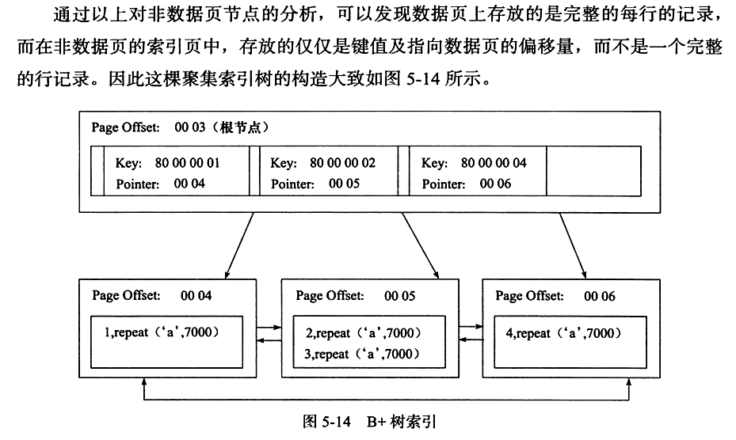

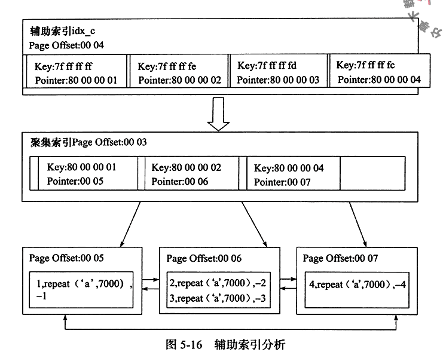

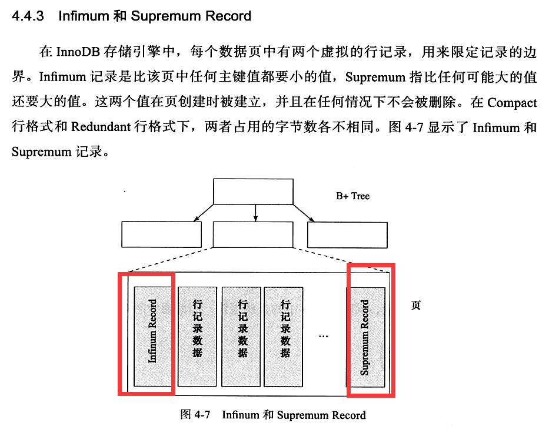


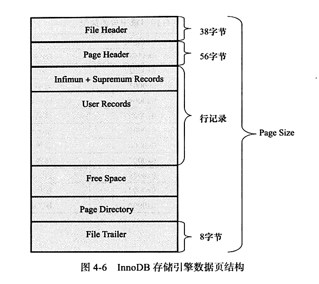

### 聚集索引和非聚集索引（辅助索引）：区别：叶子节点是否存放的一整行数据
>1，InnoDB使用的是聚簇索引，将主键组织到一棵B+树中，而行数据就储存在叶子节点上，**若使用"where id = 14"这样的条件查找主键**，则按照B+树的检索算法即可查找到对应的叶节点，之后获得行数据。
>2，**若对Name列进行条件搜索**，则需要两个步骤：第一步在辅助索引B+树中检索Name，到达其叶子节点获取对应的主键。第二步使用主键在主索引B+树种再执行一次B+树检索操作，最终到达叶子节点即可获取整行数据
>3，MyISAM的是非聚簇索引，B+Tree的叶子节点上的data，并不是数据本身，而是数据存放的地址 
>4，B+树索引可以分为聚集索引和辅助索引
>5,innodb存储，按照主键顺序存放
>6，**聚集索引就是按照每张表的主键构造一个B+树，同时叶子节点存放的整张表的行记录数据。逻辑顺序存放数据**
>7，**辅助索引，叶子节点包含键值和书签，书签指向索引对应的行数据，书签是相应行数据的聚集索引键**

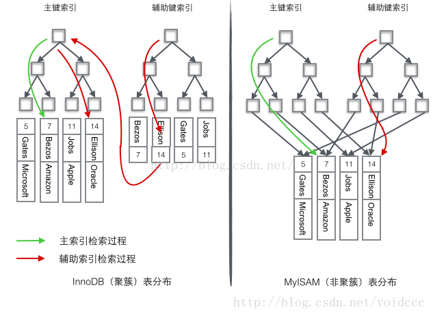
## 锁

### 锁的类型
>1，共享锁：允许读一行数据
>2，排他锁：允许删除或更新一行数据

### 锁的精度
>1，行锁
>2，表锁
>3，意向锁:意向共享锁（IS：一张表中某几行的共享锁）和意向排他锁（IX：一张表中某几行的排他锁）

### 事务锁结构

>1,select * from information_schema.INNODB_TRX;

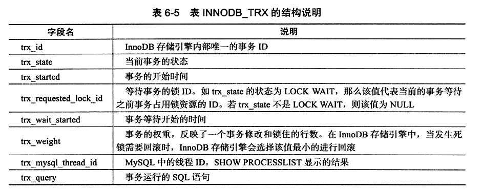


>2,select * from information_schema.INNODB_LOCKS;

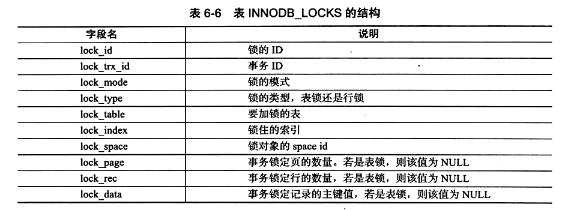

### 一致性非锁定读
>1，MVCC
>2，当读取的行正在delete或update操作，select不会等待，而是读取快照数据
>3，RC隔离级别，总是读取最新的一个快照数据，RR则总是读取事务开始时的快照，因为del或者update，对RR是不可见的
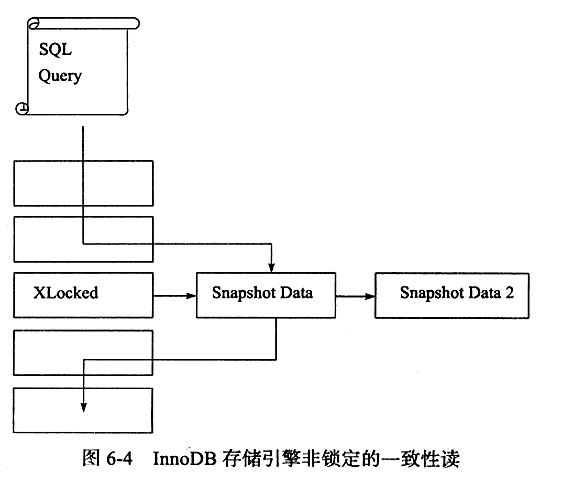
### 一致性锁定读
>1，InnoDB默认是可重复读的（ REPEATABLE READ）， MVCC多版本并发控制，实现一致性地非锁定读操作。
>2，InnoDB存储引擎的select操作使用一致性非锁定读；也就是说， select操作不会去请求共享锁S；
如何显示地使用一致性锁定读呢？
>3，第一种方法，显式地加共享锁S： select * from t1 where id=1 lock on share mode;
>4，第二种方法，显式地加排他锁X： select * from t1 where id=1 for update;

### 外健和锁
>1，插入数据时，会先查询外健关联的表，会使用select ... lock in  share mode加共享S锁，如果外健关联表在del或update，加上了X排他锁，则会等待

### InnoDB存储引擎的锁的算法有三种：
>1，Record lock：单个行记录上的锁
>2，Gap lock：间隙锁，锁定一个范围，**不包括记录本身 （区间范围应该是左开右开区间）** 
>3，Next-key lock： record+gap 锁定一个范围，**包含记录本身 （区间范围应该是左开右闭区间）**


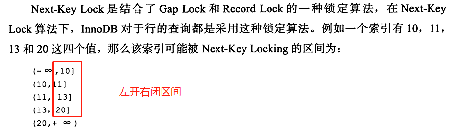
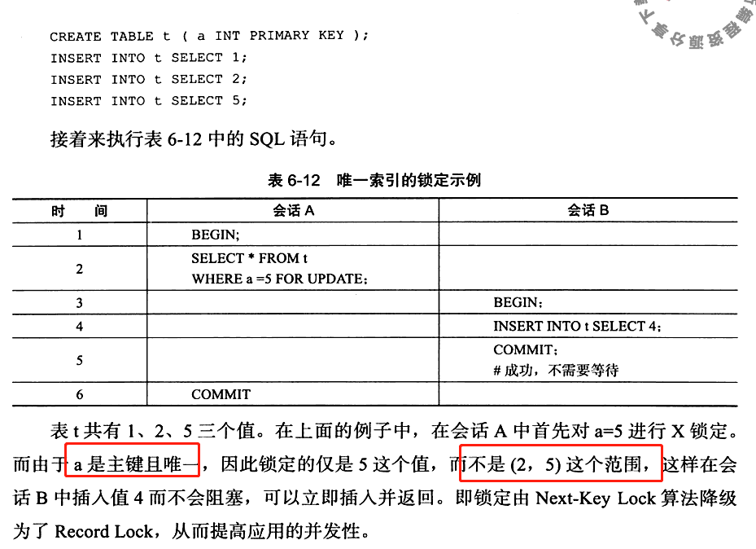

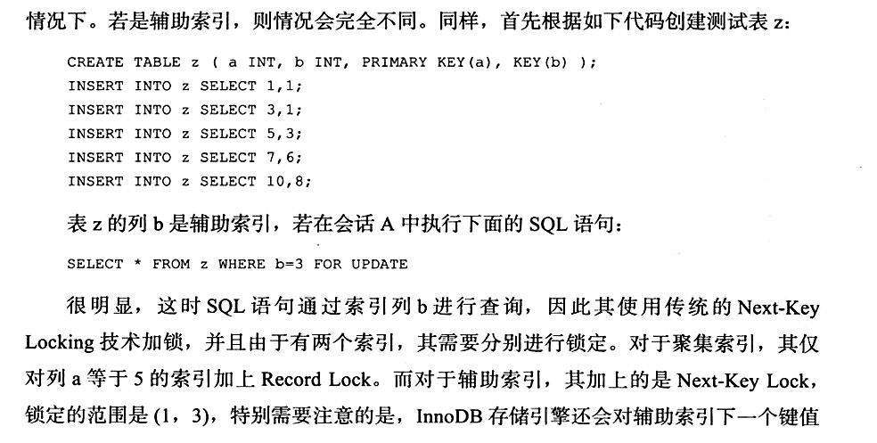

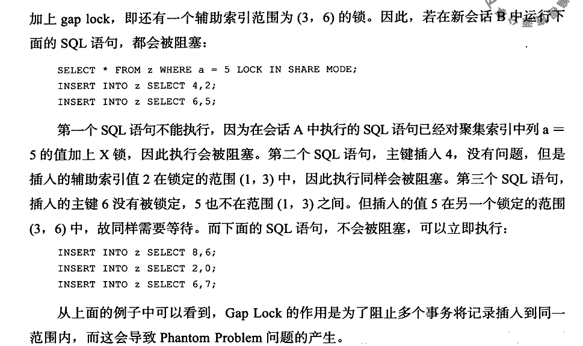

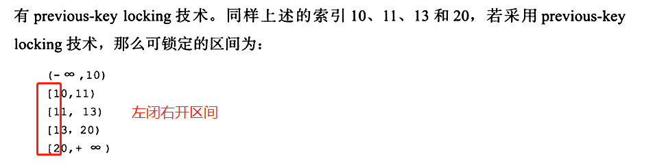

##事务
>1，页锁，这样数据量很大的场景，锁的开销就会很小
### 隔离级别
>1，未提交读（READ UNCOMMITTED）：事务中的修改，即使没有提交，对其它事务也是可见的。最低级别，任何情况都无法保证
>2，提交读（READ COMMITTED）：一个事务只能读取已经提交的事务所做的修改。换句话说，一个事务所做的修改在提交之前对其它事务是不可见的。可避免脏读的发生。**在服务器上先删除后插入，但是删除事务还没commit，所以在二进制日志中记录的是先插入后删除，在主从通过二进制日志同步数据的话，可能导致数据不一致**，**没有gap lock，可以范围插入**
>3，可重复读（REPEATABLE READ）：保证在同一个事务中多次读取同样数据的结果是一样的。可避免脏读、不可重复读的发生
>4，可串行化（SERIALIXABLE）：强制事务串行执行。可避免脏读、不可重复读、幻读的发生。InnoDB存储引擎会对每个select语句后自动加上lock in share mode，即为每个读取操作加上共享锁

 隔离级别|脏读|不可重复读|幻影读
---------|----------|---------|---------
 RU|YES|YES|YES
 RC|NO|YES|YES
 RR|NO|NO|YES
 SERIALIXABLE|NO|NO|NO

### phantom problem 幻影读问题：next-key lock=record lock+gap lock解决幻影读问题
>1，在同一事务下，连续执行两次同样的sql，可能导致不同的结果，第二次可能返回之前不存在的行，如下：RR隔离级别下，通过Next-key lock解决了这个幻影读问题
```
T1
1：select * from tab where id>2 for update;//这个会加排他锁，返回3，5
//在RC模式下，没有gap lock，在这之间执行了T2（insert id=4），插入了一条数据id=4，因为没操作3，5，不涉及3，5记录的行锁，是可以插入的，在RR会有gap lock，就不可以插入
2：select * from tab where id>2 for update;//返回3，4，5
```
>例证：T1执行select，会有排他锁，T2执行insert会等待
```
事务1
-- select @@session.tx_isolation;
START TRANSACTION;
select * from test where ord>2 for update;

-- commit;
```
```
事务2：
START TRANSACTION;
INSERT into test(ord,keyword) VALUES(4,"hello");
-- commit;
```
```
事务3：重复读，就算事务2提交了，也看不到记录4
-- select @@session.tx_isolation;
START TRANSACTION;
select * from test where ord>2;

-- commit;
```
>2，在默认Repeatable read隔离级别下，Next-Key Locking机制避免幻象读问题
### 同一事务中，对同一块数据即读又写，会彼此冲突，即基于共享锁（读写锁）互斥
```
select @@session.tx_isolation;
START TRANSACTION;
select * from users where uid='1007235';
-- select * from users where nick_name='test2' for update;
update users set gender=2 where uid='1007235';//等待读锁释放
-- select * from users where uid='1007235';
-- COMMIT;
```
### 串行隔离级别是可重复读的
``` 
事务A：
 set SESSION TRANSACTION ISOLATION LEVEL SERIALIZABLE;

START TRANSACTION;
select * from users where uid='1007235';
-- select * from users where nick_name='test2' for update;
update users set gender=2 where uid='1007235';
-- COMMIT;
``` 
``` 
事务B：
set SESSION TRANSACTION ISOLATION LEVEL SERIALIZABLE;
START TRANSACTION;
select * from users where uid='1007235' 
-- for update;

-- COMMIT;
```
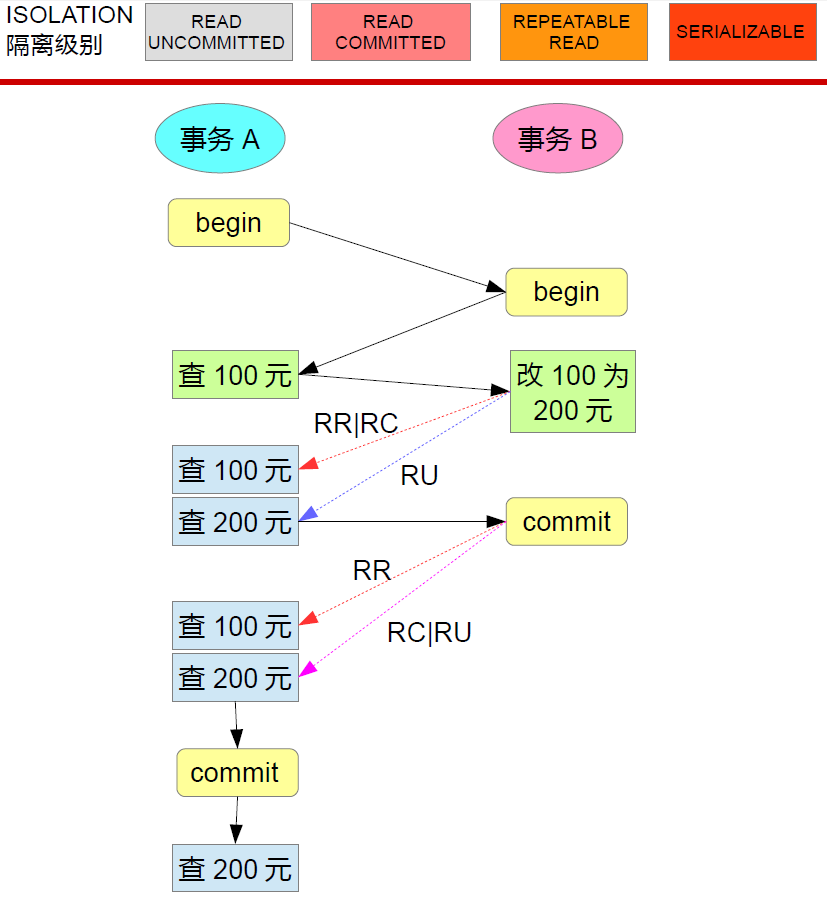

### select for update 会触发行锁
>1，事务A和B串行
>2，事务中两个select不会导致死锁
``` 
事务A：
START TRANSACTION;
select * from users where uid='1007235' for update;
select * from users where nick_name='test2' for update;
update users set gender=1 where uid='1007235';
COMMIT;
```
``` 
事务B：
START TRANSACTION;
select * from users where uid='1007235' for update;
select * from users where nick_name='test2' for update;
update users set gender=2 where uid='1007235';
COMMIT;
```
### 事务分类
>1，扁平事务flat transaction：最频繁的类型事务，所有操作处于同一层次
>2，带有保存点的扁平事务flat transaction with save points
>3，链事务chained transaction
>4，嵌套事务nested transaction
>5，分布式事务 distribution transaction：innoDB的事务必须是串行化事务，两段式提交（1，prepare准备阶段，2，rollback或commit），XA事务支持分布式事务的实现（语法：XA {BEGIN|START} xid {join|resume}}）

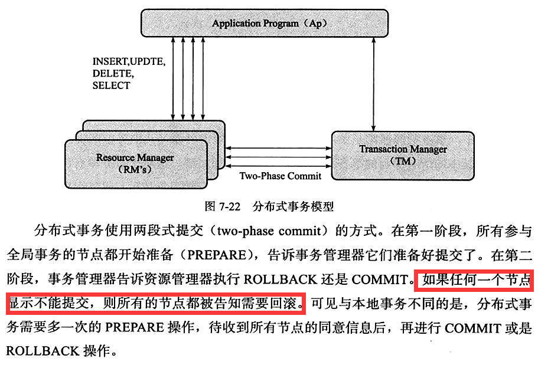

###事务使用，不好的习惯
>1，循环中提交事务，性能差
>2，使用自动提交：1)mysql C API是默认自动提交，2）Mysql python API是set AUTOCOMMIT=0,禁用自动提交，不同语言的API是不一样的  3）开发人员应该掌握事务的控制权限（何时开始结束）
>使用自动回滚：以致开发人员不知道事务执行中抛出的具体的异常

### 事务的实现
>1，redo log重做日志，用来保证事务的原子性和持久性，undo log用来保证事务的一致性
>2，redo恢复提交事务修改的页操作，undo回滚记录到某个特定版本
>3，redo物理日志，记录的页的物理修改操作，undo是逻辑日志，记录每行的操作
>4，redo两部分：1，内存中的重做日志缓冲，易失，2，重做日志文件，持久


## profiling分析查询

>1，查看是否开启profiling：select @@profiling;
>2，开profiling。注意测试完关闭该特性，否则耗费资源：set profiling=1;
>3，查看所有记录profile的SQL：show profiles;
>4，查看指定ID的SQL的详情：show profile for query 1;
>5，测试完，关闭该特性：set profiling=0;
>6，执行一条语句之后，查看执行效率：show profiles;
>7，查看mysql最大链接数： show variables like 'max_connections';
>8，查看已经使用的最大连接数：show status like 'max%connections';max_used_connections / max_connections * 100% （理想值≈ 85%）
>9，同时查看不同资源开销 **show profile block io,cpu for query $Query_ID**

## 查看数据文件：show global variables like "%datadir%";
>1,.frm文件：存储数据表的框架结构，文件名与表名相同，每个表对应一个同名frm文件，与操作系统和存储引擎无关，即不管MySQL运行在何种操作系统上，使用何种存储引擎，都有这个文件
>2,InnoDB采用表空间（tablespace）来管理数据，存储表数据和索引:1)ibdata1、ibdata2等：系统表空间文件，存储InnoDB系统信息和用户数据库表数据和索引，所有表共用;  2).ibd文件：单表表空间文件，每个表使用一个表空间文件（file per table），存放用户数据库表数据和索引;   3)日志文件： ib_logfile1、ib_logfile2
>3,MyISAM数据库表文件:1).MYD文件：即MY Data，表数据文件;  2).MYI文件：即MY Index，索引文件

## 查看慢查询日志：show variables like "%slow%";
>1，慢查询日志用来记录响应时间超过阈值的SQL语句，set global slow_query_log='ON';只是对当前数据库有效，如果MySQL数据库重启后就会失效。所以如果要永久生效，就要修改配置文件 my.cnf
>2，我们可以设置一个阈值，将运行时间超过该值的所有SQL语句都记录到慢查询日志文件中。该阈值可以通过参数 long_query_time 来设置，默认为10秒，set global long_query_time=0.05;
>3，查询是否用到索引show variables like 'log_queries_not_using_indexes';
>4，错误日志文件，慢查询日志文件那样用cat，head, tail等命令可以查看
>5，mysqldumpslow iz2zeaf3cg1099kiidi06mz-slow.log

## 二进制日志：记录了对数据库执行更改的所有操作，但是不包括select和show这类操作：mysqlbinlog mysqld-bin.000001
>1，恢复(recovery)： 某些数据的恢复需要二进制日志，如当一个数据库全备文件恢复后，我们可以通过二进制的日志进行 point-in-time的恢复
>2，复制(replication) : 通过复制和执行二进制日志使得一台远程的 MySQL 数据库(一般是slave 或者 standby) 与一台MySQL数据库(一般为master或者primary) 进行实时同步
>3，审计(audit)：用户可以通过二进制日志中的信息来进行审计，判断是否有对数据库进行注入攻击


## 查询日志:记录select和show操作：show variables like "general_log%";
>1，开启： set global general_log='ON';

## pt-query-digest 是分析MySQL查询日志最有力的工具
>1，可以分析binlog，Generallog，slowlog，也可以通过show processlist或者通过 tcpdump 抓取的MySQL协议数据来进行分析，比 mysqldumpslow 更具体，更完善
>2，pt-query-digest  slow.log > slow_report.log

## mysql体系结构
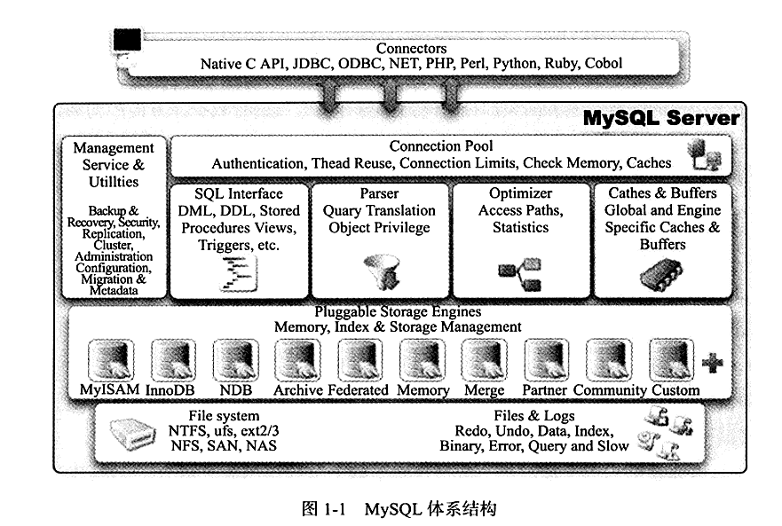

>1，四种隔离级别，默认Repeatable read
>2，insert buffer
>3，二次写 double write
>4，自适应哈希索引，adaptive hash index
>5，预读，read ahead
>6，多版本并发控制MVCC获得高并发，并实现了4种隔离

## 引擎
>1，InnoDB
>2，MyISAM
>3，Memory：数据存放在内存
>4，NDB：集群引擎
>5，Archive：只支持select和insert
>6，Federated
>7，Maria

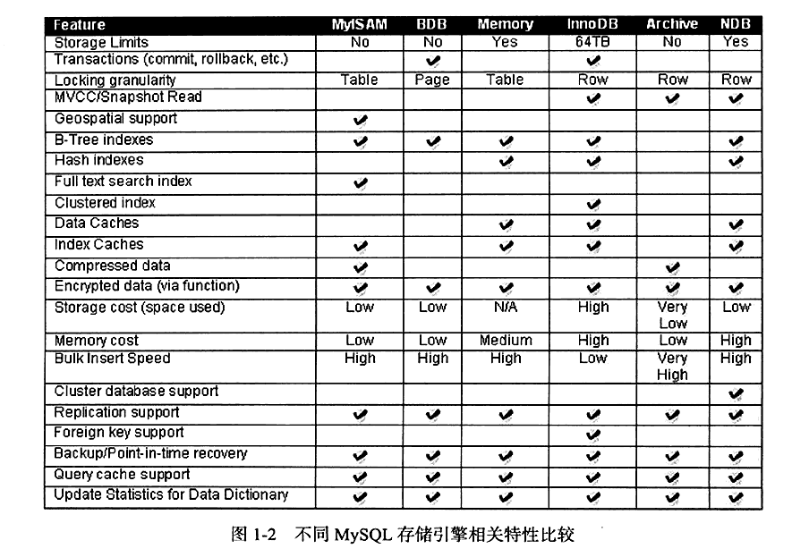

## InnoDB
>1，聚集方式，表的存储按照逐渐的顺序进行存放，没有主键，则默认生成一个6B的ROWID
>2，MVCC，多版本并发控制，获得高并发

## MyISAM
>1，不支持事务，表锁设计，支持全文索引，主要面向OLAP
>2，只缓存索引文件，不缓冲数据文件

## B-Tree
**模拟查找关键字 29 的过程：**

>1，根据根节点找到磁盘块 1，读入内存。【磁盘 I/O 操作第 1 次】
>2，比较关键字 29 在区间（17,35），找到磁盘块 1 的指针 P2。
>3，根据 P2 指针找到磁盘块 3，读入内存。【磁盘 I/O 操作第 2 次】
>4，比较关键字 29 在区间（26,30），找到磁盘块 3 的指针 P2。
>5，根据 P2 指针找到磁盘块 8，读入内存。【磁盘 I/O 操作第 3 次】
>6，在磁盘块 8 中的关键字列表中找到关键字 29。


## B+Tree

>1，数据是存在叶子节点中的；
>2，数据节点之间是有指针指向的。
>3，**MyISAM和MySQL是采用的B+Tree**。目前大多数数据库系统及文件系统都采用 B-Tree 或其变种 B+Tree 作为索引结构
>4，系统从 **磁盘读取数据到内存时是以磁盘块（block）为基本单位**的，**InnoDB存储引擎使用页**作为数据读取单位，页是其磁盘管理的最小单位，默认page大小是 16k。系统的一个磁盘块的存储空间往往没有这么大，因此 InnoDB 每次申请磁盘空间时都会是若干地址连续磁盘块来达到页的大小 16KB。
>5，在查询数据时如果一个页中的每条数据都能助于定位数据记录的位置，这将会减少磁盘 I/O 的次数，提高查询效率

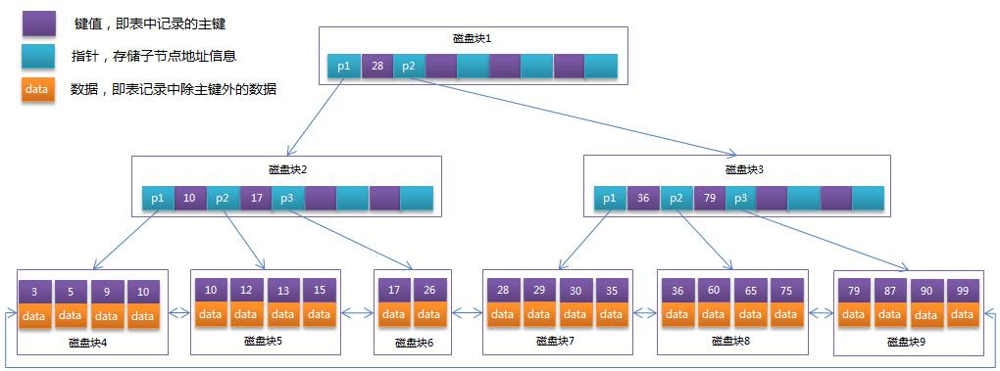

## innoDB深入研究
* [innodb深入学习和研究](https://github.com/BoobooWei/inside-innodb)

>1，聚集方式，表的存储按照逐渐的顺序进行存放，没有主键，则默认生成一个6B的ROWID
>2，MVCC，多版本并发控制，获得高并发
>3，show engine innodb status;

### InnoDB关键特性
>1，Insert Buffer（非聚集数据写入的性能）：提高对于非聚集索引的插入和更新的性能，因为B+树的特性，对于非聚集索引离散的数据的插入和更新，性能会很慢
>1.1，索引是辅助索引且不唯一
>1.2，先判断非聚集索引页是否在缓冲池中，在，则直接插入，不在，则放入Insert Buffer对象中，以一定频率，进行Insert Buffer和辅助索引页子节点merge，通常多个插入合并到一个操作中，性能得到提高
>1.3，**插入操作时，数据页按主键顺序存放，但是对于非聚集索引叶子节点插入不再是顺序的，需要离散的访问非聚集索引页，还是不是很明白，什么叫非聚集索引页，不是一条数据都有主键嘛？**
>1.4，升级版change buffer（Insert buffer，delete buffer，purge buffer）
>1.5，Insert buffer的数据结构B+树
```
create table employees (
    id int not null,
    b varchar(30),
   Primary key(id),
   key(b)//辅助索引
);
```
>2，double write（可靠性）：写入数据页到表中，写了一部分宕机，部分写失效。需要副本来恢复重做日志页，再恢复数据
>2.1，两部分组成：内存中的double write buffer（2MB）和磁盘上共享表空间中连续的2MB页空间
>2.2，缓冲池刷新到 double write buffer，再分两次顺序写入共享表空间，然后fsync函数，同步磁盘

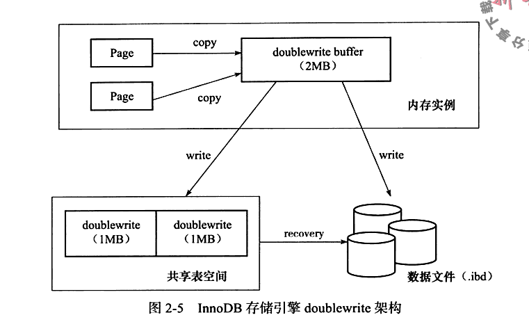

>3，自适应hash：官方称，读写性能提高2倍
>3.1，在生产环境中，B+树一般3~4层
>3.2，默认开启

>4，AIO（磁盘操作性能）
>4.1，访问页（space，page_no），当3个操作（8，6），（8，7），（8，8），会合并为从（8，6）开始连续读取3页48KB的数据

>5，刷新邻近页
>5.1，当刷新脏页，检测该页所在的区的所有页，如果有脏页，则一起刷新
>5.2，有超高的IOPS性能的固态硬盘，建议关闭此特性

###InnoDB体系架构
>1，每个页都有版本，LSN（log sequence number）标记版本，8B


#### InnoDB的多线程模型
>1，Master thread：缓冲池数据异步刷新到磁盘
>2，AIO（asynic IO）：write，read，insert buffer ，log IO thread
>3，purge thread：回收已经使用并分配的undo页
>4，page cleaner thead：脏页刷新


## checkpoint机制：缓冲池-》磁盘
>1，**为了避免数据丢失，当前事务数据库都采用Write Ahead log策略，即当事务提交时，先写重做日志，再修改页**
>2，缩短数据库恢复时间
>3，缓冲池不够用时，将脏页刷新到磁盘
>4，重做日志不可用时，刷新脏页
>5，当数据库发生宕机，数据库不需要重做所有的日志，只需对checkpoint后的重做日志进行恢复

### sharp checkpoint
>1，数据库关闭时将所有的脏页刷新会磁盘
### fuzzy checkpoint：只刷新一部分脏页
>1，master thread checkpoint：每秒或每十秒刷新一定比例的脏页回磁盘
>2，Flush_LRU_LIST checkpoint：保证LRU列表有约100个空闲页可使用
>3，async/sync Flush checkpoint：重做日志不可用的情况下，强制将一部分页刷新到磁盘
>4，dirty page too much checkpoint

## InnoDB内存数据对象
>1，LRU(Latest recent used，最近最少使用，最频繁的再LRU列表前端))
>2，midpoint insertion strategy：新访问的页，不直接放到LRU列表的前端，都是放到midpoint（默认是5/8，show variables like ‘innodb_old_blocks_pct’;显示百分比） ,midpoit之前称为new列表，之后为old列表。可能新访问的不是热点数据，直接插入LRU列表前端，可能会把列表尾的热点数据刷出缓冲池

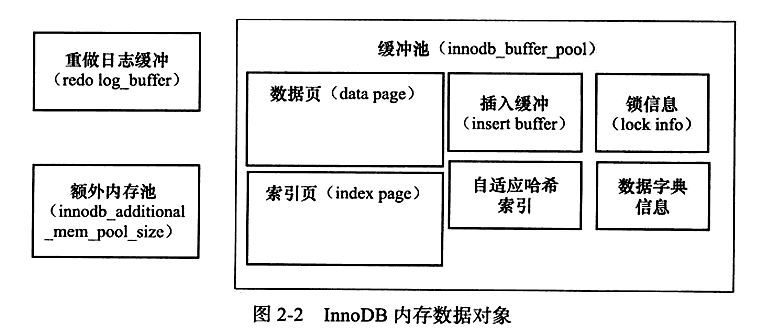


## 查询

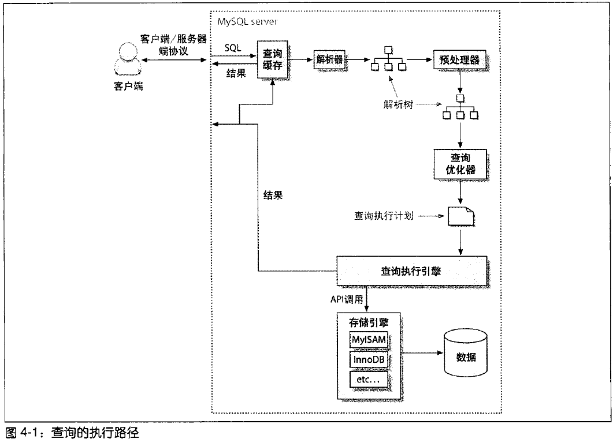

## 分区：水平分区，并不支持垂直分区
>1，主键肯定是唯一键，那么分区键就必须是主键的真子集。然而目前大部分数据表都不会把有实质意义的业务字段作为主键，这就使得分区的业务意义大大降低了。比如，主键是自增长的id，可以视作记录插入的时间顺序，如果按照id分区，再以class_code之类有实际意义的字段为条件做查询时，分区就派不上用场了

### RANGE分区（常用）
```
create table employees (
    id int not null,
    fname varchar(30),
    lname varchar(30),
    hired date not null default '1970-01-01',
    separated date not null default '9999-12-31',
    job_code int not null,
    store_id int not null
) partition by range (store_id) (
    partition p0 values less than (6),
    partition p1 values less than (11),
    partition p2 values less than (16),
    partition p3 values less than (21)，
    partition p3 values less than maxvalue
);
```
### LIST分区：将要匹配的任何值都必须在值列表中找到
```
create table employees (
    id int not null,
    fname varchar(30),
    lname varchar(30),
    hired date not null default '1970-01-01',
    separated date not null default '9999-12-31',
    job_code int not null,
    store_id int not null
) partition by list(store_id)
    partition pNorth values in (3,5,6,9,17),
    partition pEast values in (1,2,10,11,19,20),
    partition pWest values in (4,12,13,14,18),
    partition pCentral values in (7,8,15,16)
)；
```
### HASH分区：PARTITION BY HASH (expr)，“expr”是一个返回一个整数的表达式
```
create table employees (
    id int not null,
    fname varchar(30),
    lname varchar(30),
    hired date not null default '1970-01-01',
    separated date not null default '9999-12-31',
    job_code int not null,
    store_id int not null
) partition by hash(store_id)  partitions 4；
```

### KSY分区：KEY分区只支持计算一列或多列。必须有一列或多列包含整数值
```
 create table tk (
    col1 int not null,
    col2 char(5),
    col3 date
) partition by linear key (col1)
partitions 3;
```
### 复合分区

### 优化分区
>1，ALTER TABLE emp optimize partition p1,p2;

### 合并分区
>1，alter table te reorganize partition p1,p3 into (partition p1 values less than (1000));

### 查看分区信息
>1，SELECT * FROM INFORMATION_SCHEMA.PARTITIONS WHERE TABLE_NAME = 'part_tab'
>2，explain partitions select * from `part_tab`;
>3，SELECT PARTITION_NAME,TABLE_ROWS FROM INFORMATION_SCHEMA.PARTITIONS WHERE TABLE_NAME = 'sale_data';
>4，**如果是range分区表，那么null行将被保存在范围最小的分区。如果是list分区表，那么null行将被保存到list为0的分区。在按HASH和KEY分区的情况下，任何产生NULL值的表达式mysql都视同它的返回值为0。为了避免这种情况的产生，建议分区键设置成NOT NULL**


### QA
>1，分区删除或调整分区规则了，会怎么样
>2，分区数据不均

### locks表：用于记录InnoDB事务尝试申请但还未获取的锁，以及阻塞其他事务的事务所拥有的锁 
>1,select * from information_schema.innodb_locks;

## 主从复制，数据一致性


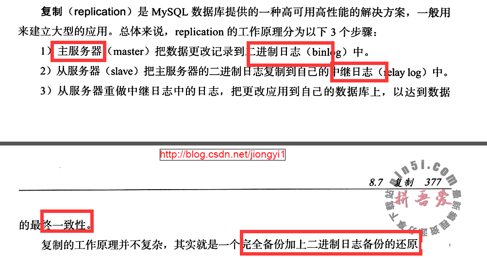

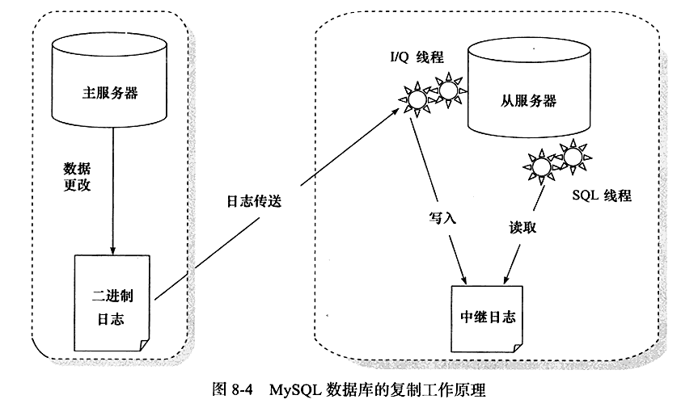


#### insert-on-duplicate
>1,如果是插入操作，受到影响行的值为1；如果更新操作，受到影响行的值为2；如果更新的数据和已有的数据一样（就相当于没变，所有值保持不变），受到影响的行的值为0（update_time on update CURRENT_TIMESTAMP,也不会变）
>2,如果有两个事务并发的执行同样的语句，那么就会产生death lock:一个事务中先S（贡献锁）后X（排他锁），那多个一样的事务并发，可能会导致死锁
